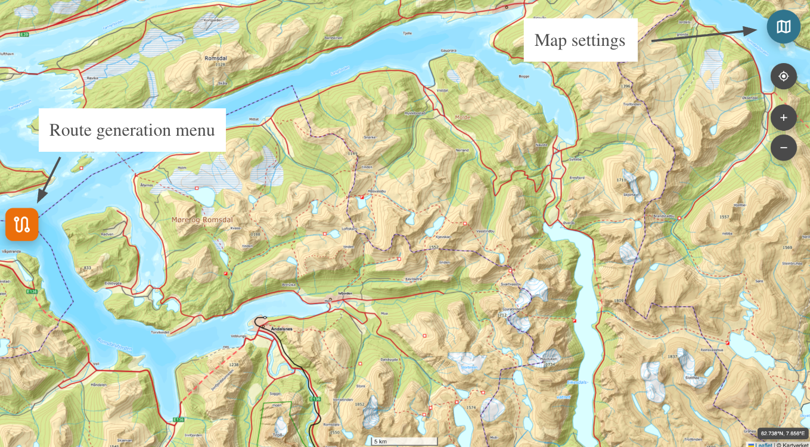
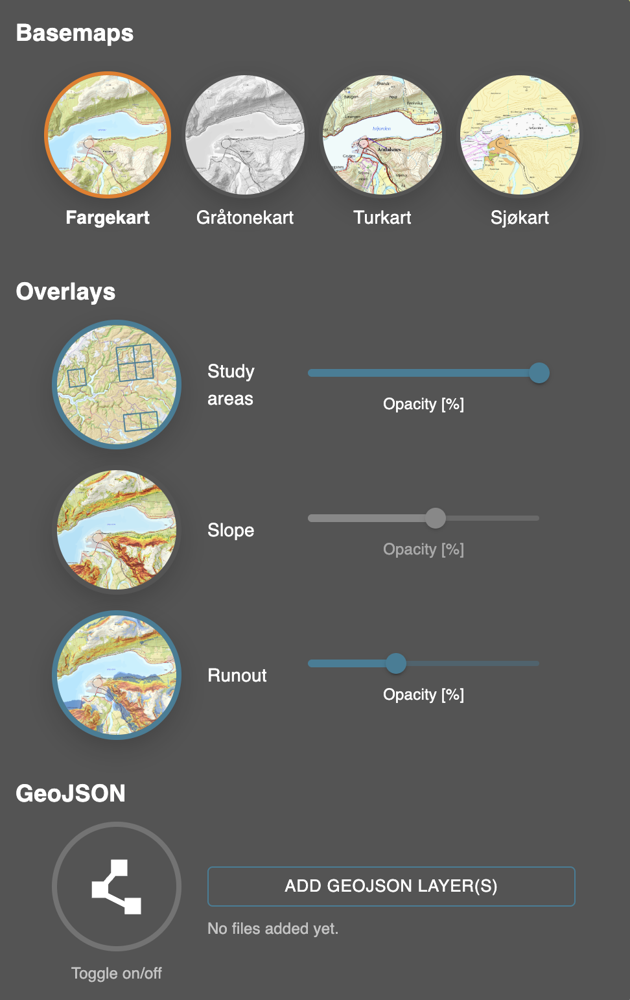
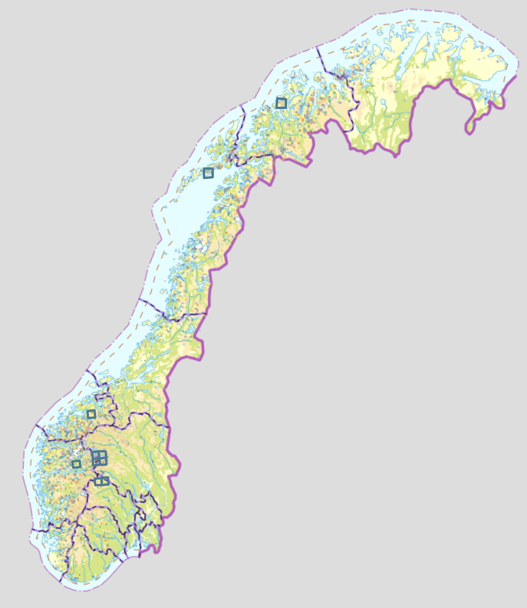
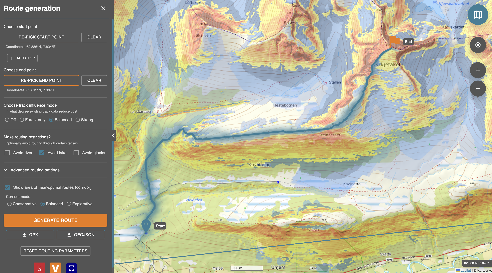
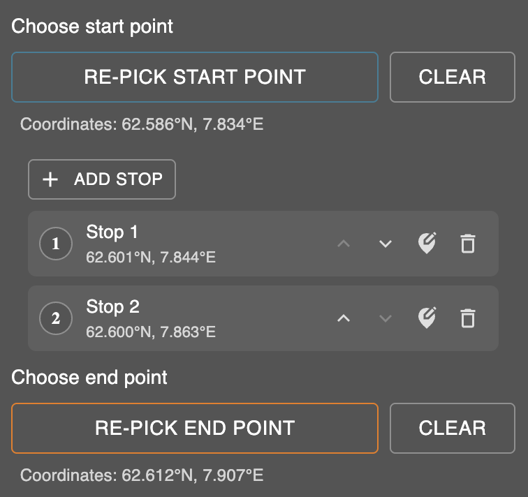
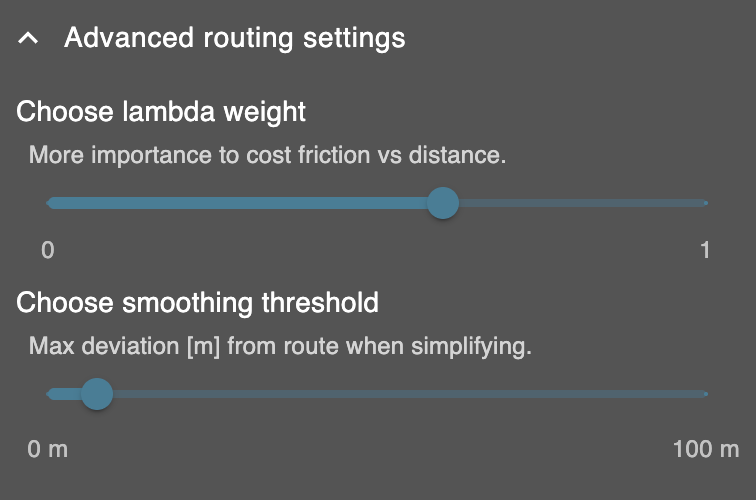

# Routing Application Guide

This guide summarizes how to use the interactive routing application developed
for the thesis. The application is intended for testing the routing algorithm in
the predefined study areas, not as a complete avalanche-safety product.

Application URL:

```text
https://pederundheim.github.io/routing-algorithm/
```

## Overview

When opened, the application shows an interactive map with two main menus. The
route generation menu is used to define route inputs and generate routes. The
map settings menu is used to change basemaps, activate overlays, and add
external GeoJSON layers.



## Map Settings And Study Areas

The map settings menu allows the user to switch between available basemaps:
colour map, greyscale map, hiking map, and nautical map. Basemaps and overlays
are toggled by clicking their image icons. A coloured circle around an icon
indicates that the layer is active.

The study-area overlay shows where route generation is available. Routes can
only be generated within the predefined study areas. The slope and runout
overlays can be activated to inspect terrain conditions, and opacity sliders
control how strongly overlays are displayed. Custom GeoJSON layers can also be
added for comparison or inspection.





## Generate A Route

1. Open the route generation menu.
2. Press the start-point button and click the map to place the start marker.
3. Press the end-point button and click the map to place the end marker.
4. Keep both points inside the predefined study areas.
5. Choose the desired track influence mode.
6. Optionally activate terrain restrictions such as avoiding rivers, lakes, or
   glaciers.
7. Optionally enable a route corridor and choose corridor mode.
8. Press `Generate route`.

The route calculation may take some time. When complete, the generated route is
displayed on the map and can be downloaded as GPX or GeoJSON.



## Additional Routing Options

Intermediate stops can be added when the generated route should pass through
specific locations between the start and end points. Stops can be added,
removed, edited, and reordered in the route generation menu.

The advanced settings provide additional control over route calculation. The
lambda weight controls the relative importance of cost friction compared with
distance. A higher value gives more importance to the cost surface, while a
lower value gives more importance to shorter distance. The smoothing threshold
controls the maximum allowed deviation from the original route when simplifying
the generated route geometry.





## Interpret The Output

The generated route represents the least-cost route between the selected points
under the chosen routing settings. If activated, the route corridor shows terrain
with similar accumulated cost around the generated route. The corridor should be
interpreted as a visualization of near-optimal alternatives, not as a safe travel
zone.

The routing application is a decision-support interface for the routing
framework. It does not account for current snowpack conditions, weather,
visibility, group ability, or other dynamic factors. Generated routes must
therefore be evaluated critically together with current avalanche forecasts and
field observations.
